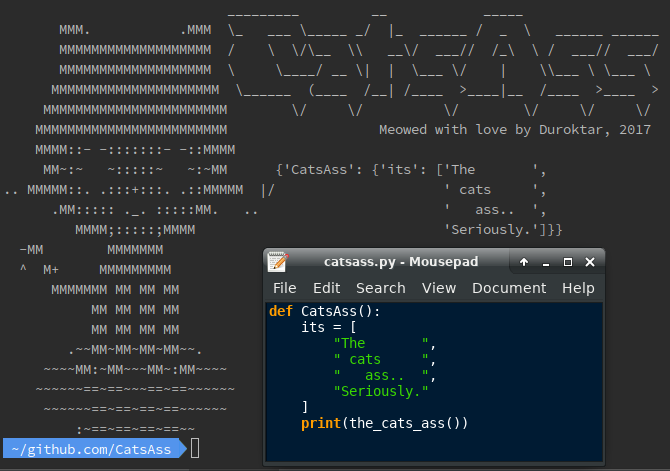
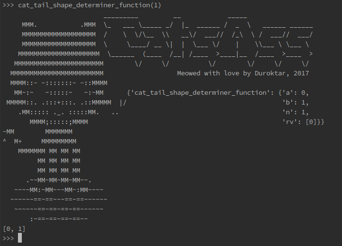

CatsAss
=======

.. image:: https://img.shields.io/pypi/v/CatsAss.svg
        :target: https://pypi.python.org/pypi/CatsAss

Seriously the cats ass. Seriously.

WTF is it?
==========

CatsAss is the cats ass for replacing multiple prints in
simple debugging situations. So..

**Instead of this..**

.. code-block:: python

    def cat_tail_shape_determiner_function(n):
        a, b = 0, 1
        rv = [a]
        while a < n:
           print('a:', a)
           print('b:', b)
           print('rv:', rv)
           a, b = a + b, b
           rv.append(a)
        return rv

----

**Do this.**

.. code-block:: python

    from catsass import the_cats_ass

    def cat_tail_shape_determiner_function(n):
        a, b = 0, 1
        rv = [a]
        while a < n:
           print( the_cats_ass() )
           a, b = a + b, b
           rv.append(a)
        return rv

**It's the cats ass!!**

- *Minimum terminal width of 80 characters recommended*
- MIT_ licensed

.. _MIT: https://en.wikipedia.org/wiki/MIT_License

Installation
============

**Requires python 3.6**

To install CatsAss, run this command in your terminal:

.. code-block:: console

    $ pip install CatsAss

If you don't have `pip`_ installed, this `Python installation guide`_ can guide
you through the process.

.. _pip: https://pip.pypa.io
.. _Python installation guide: http://docs.python-guide.org/en/latest/starting/installation/

Bugs
----

CatsAss works by inspecting the stack frames, which isn't always
the right context. In this case it isn't really the cats ass
anymore.. Luckily you can poke the cat in different places
until you get the context you want.

.. code-block:: python

    from catsass import the_cats_ass, comb, Cats

    def long_cat_tail():
        def cat_tail_shape_determiner_function(n):
            a, b = 0, 1
            rv = [a]
            while a < n:
               print( poke_the_cat(Cats.TAIL, catnip=True) )
               a, b = a + b, b
               rv.append(a)
            return rv
        return cat_tail_shape_determiner_function(100)

Issues
------

Deep personal ones, yes.

Coding
-------

Duroktar - duroktar@gmail.com

Legal
-----

- The CatsAss logo was created with the help of this great site -
  http://patorjk.com/software/taag/#p=display&f=Graffiti&t=CatsAss

- The ascii-OCTOCAT was taken from https://github.com/audy/catsay, MIT.

- The OCTOCAT design is the exclusive property of GitHub. All rights reserved.

----

*This package was originally created with* PyRelease_ *package maker.* 2017

.. _PyRelease: https://github.com/pyrelease/pyrelease
